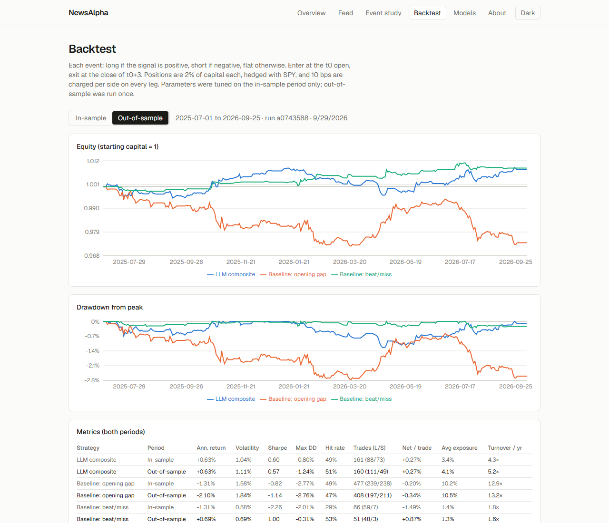
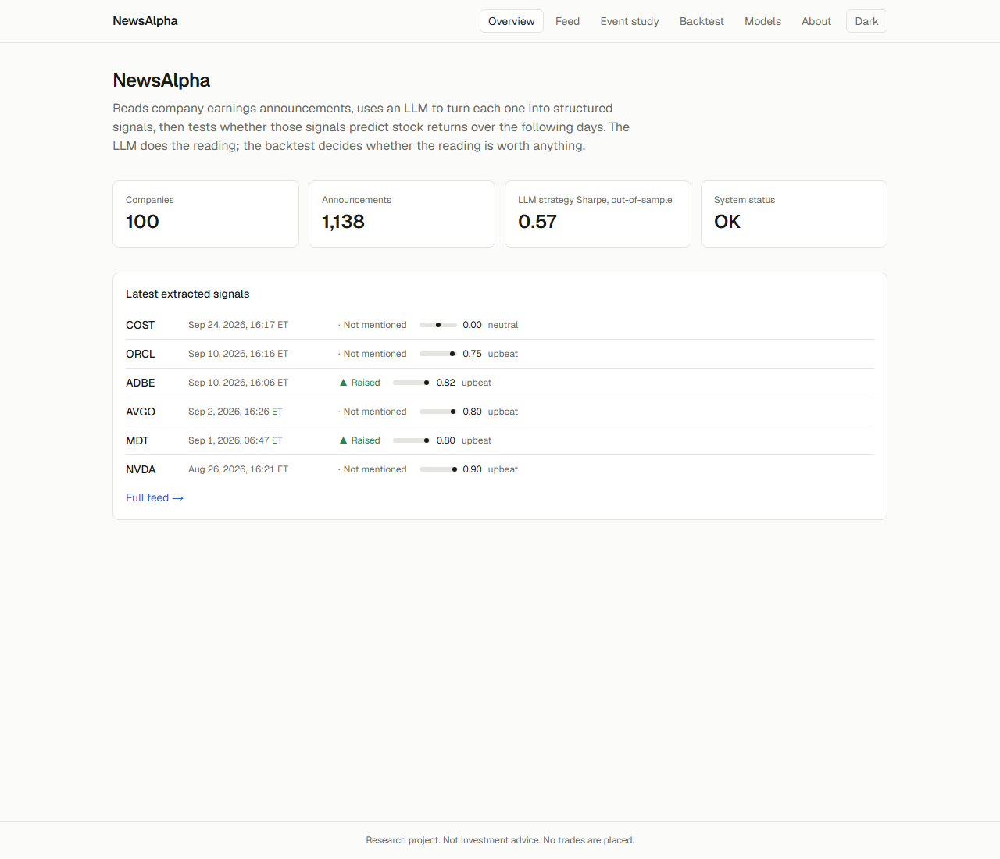
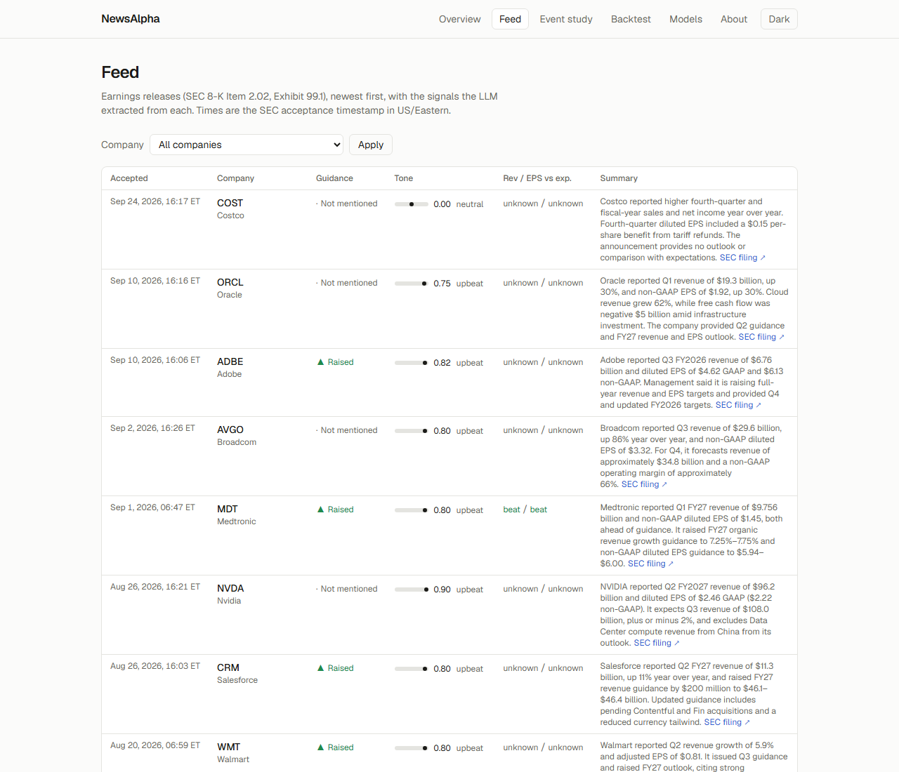
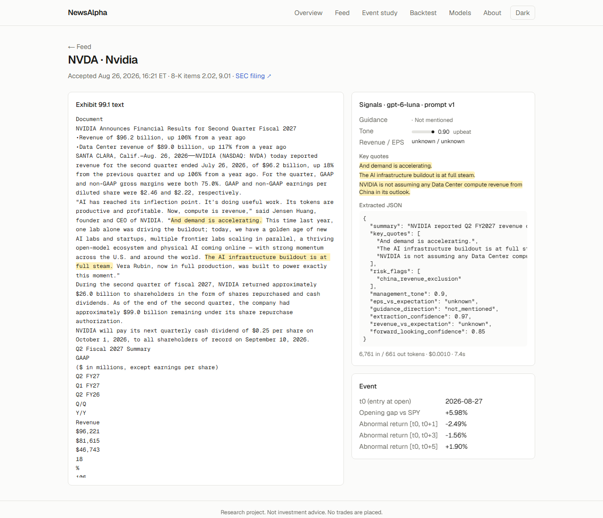
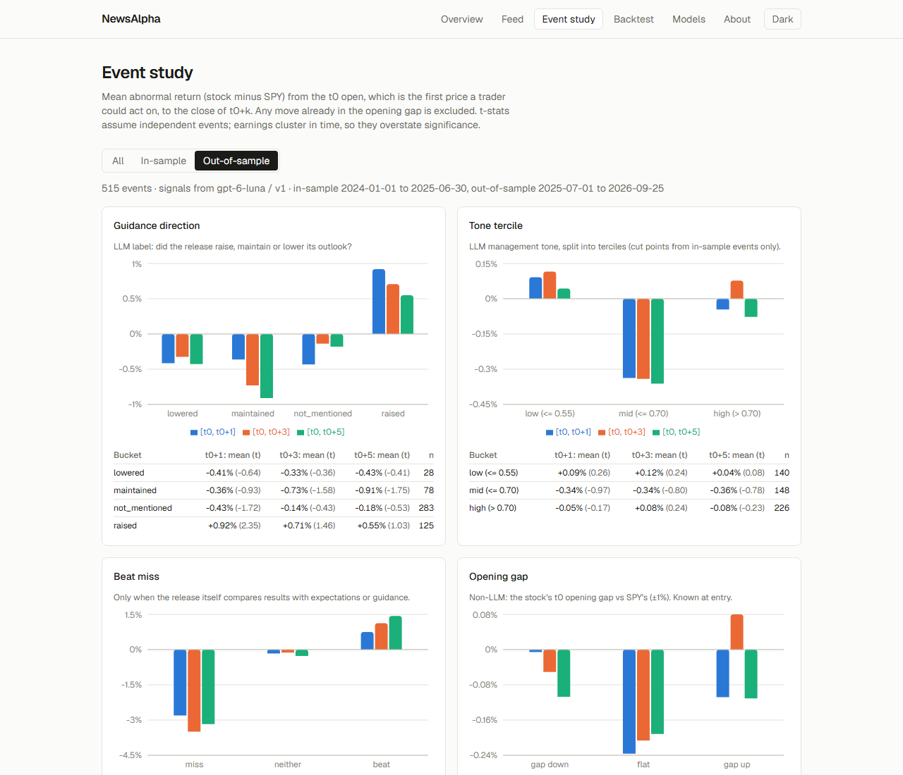
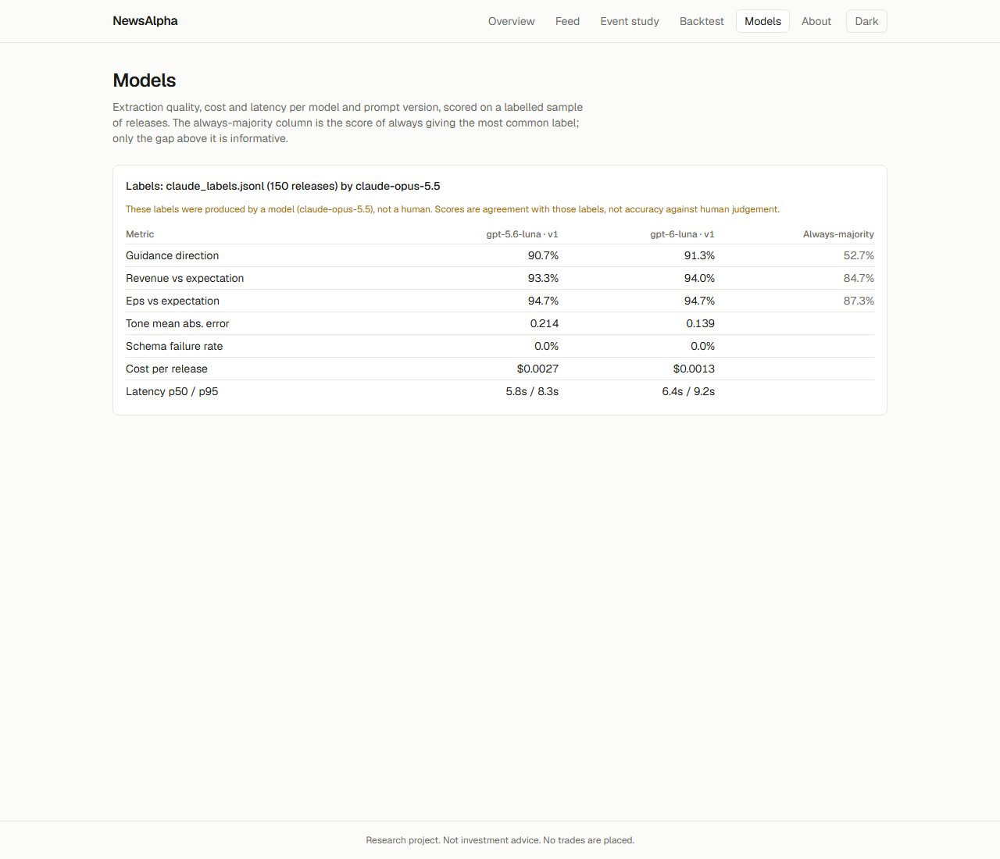
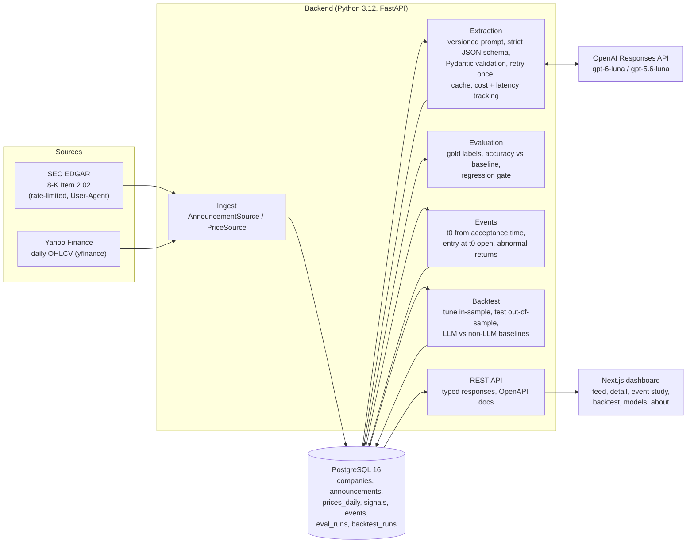

# NewsAlpha

An LLM signal lab for market announcements. NewsAlpha reads US company earnings releases
(SEC 8-K Item 2.02, Exhibit 99.1), uses an LLM to turn each one into structured signals, and then
tests whether those signals predict stock returns over the following days.

**The LLM does the reading. The backtest decides whether the reading is worth anything.**

> Research project only. It places no trades, has no broker integration and gives no investment
> advice.



## Results at a glance

These figures are a snapshot of the stored runs (backtest run `a0743588`, 29 Sep 2026). The
dashboard reads the live numbers from the API.

**Data:** 1,138 earnings releases from 100 S&P 100 companies (Jan 2024 to Sep 2026), with 71,306
daily price bars. Signals come from `gpt-6-luna` with prompt v1: 0 schema failures, about $0.0013
per release, **$1.47 for the full set**.

### Backtest

Setup: long/short, enter at the t0 open, exit at the close of t0+3. The book is hedged with SPY and
pays 10 bps per side on every leg. The in-sample period is 2024-01-01 to 2025-06-30; the
out-of-sample period (2025-07-01 to 2026-09-25) was run once with the parameters fitted in-sample.

| Strategy | Period | Sharpe | Trades | Hit rate | Net return / trade |
|---|---|---|---|---|---|
| **LLM composite** | in-sample | 0.60 | 161 | 49% | +0.27% |
| **LLM composite** | **out-of-sample** | **0.57** | 160 | 51% | +0.27% |
| Baseline: opening gap (no LLM) | in-sample | -0.82 | 477 | 49% | -0.20% |
| Baseline: opening gap (no LLM) | out-of-sample | -1.14 | 408 | 47% | -0.34% |
| Baseline: beat/miss (PRD naive rule) | in-sample | -2.26 | 66 | 29% | -1.49% |
| Baseline: beat/miss (PRD naive rule) | out-of-sample | 1.00 | 51 | 53% | +0.87% |

How to read this:

- **The LLM signal survives out-of-sample, but it is weak.** Sharpe is about 0.6 in both periods,
  with a near coin-flip hit rate and a small edge per trade. That is encouraging, not tradable.
- **It beats the honest non-LLM baseline.** The baseline follows the stock's opening gap relative
  to SPY, which is the market's own first reaction and is known at entry. It loses in both periods.
- **The beat/miss baseline is noise.** Releases rarely state beat or miss against expectations,
  and the model is barred from using outside knowledge, so there were only 7 and 3 miss trades.
  Its sign flips between periods.
- **Absolute returns are tiny because the book is mostly empty.** Positions are 2% each and about
  2 are open on a typical day, so average exposure is about 4% of capital. Sharpe and net return
  per trade are the comparable numbers.

### Event study

The event study measures mean abnormal return (stock minus SPY) from the t0 open, so any move
already in the opening gap is excluded.

| Bucket, window [t0, t0+1] | In-sample | Out-of-sample |
|---|---|---|
| Guidance **raised** | +0.27% (t 0.75, n 101) | **+0.92% (t 2.35, n 125)** |
| Guidance **lowered** | -0.11% (n 43) | -0.41% (n 28) |
| Tone, top tercile | **+0.60% (t 2.25, n 194)** | -0.05% (t -0.17, n 226) |

- **Guidance direction carries the signal.** It points the same way in both periods.
- **Tone looked significant in-sample and disappeared out-of-sample.** This is exactly why the
  split exists.

### Extraction quality

Both models were scored on 150 releases labelled by **Claude (Opus 5.5), not a human**, so these
figures are agreement with a stronger model, not accuracy. The last column is the score of always
answering the most common label.

| Field | gpt-6-luna | gpt-5.6-luna | Always-majority |
|---|---|---|---|
| Guidance direction | **91.3%** | 90.7% | 52.7% |
| Revenue vs expectations | 94.0% | 93.3% | 84.7% |
| EPS vs expectations | 94.7% | 94.7% | 87.3% |
| Tone mean absolute error | **0.139** | 0.214 | |
| Cost per release | **$0.0013** | $0.0027 | |

The cheaper model is at least as good on every field. Beat/miss agreement is high mostly because
both sides answer "unknown".

## Screenshots

| | |
|---|---|
|  |  |
|  |  |
|  |  |

## How it works



### Point-in-time rules (tested)

Everything is anchored to the SEC **acceptance timestamp** (US/Eastern, read from the filing's
SEC header).

- **Event day t0.** A release accepted before 09:30 ET on a trading day trades that day. Anything
  accepted during market hours, after the close, or on a non-trading day trades the next trading
  day. The NYSE calendar covers holidays and early closes.
- **Entry** is always at t0's adjusted open.
- **No lookahead.** Signal inputs are read through a point-in-time price view that raises an error
  if code asks for a price not yet known at entry. The opening-gap baseline uses only the t0 open
  and the previous close. A "lookahead trap" test plants absurd future prices and checks that entry,
  gap and decisions do not change.
- **Returns are outcomes only.** Window returns run from the entry open to the close of t0+k and
  never feed a signal.
- **The universe is fixed in advance:** S&P 100 members as of 2023-09-18, taken from a Wikipedia
  revision saved before the study window.

### LLM design

- **The LLM only reads and labels.** All maths (returns, weights, metrics) is deterministic Python.
- **Structured output** is a strict JSON schema: guidance direction, revenue and EPS vs
  expectations, management tone, forward-looking confidence, risk flags, key quotes, summary and
  extraction confidence.
- **Validation:** every response is validated with Pydantic. On failure the model gets one retry
  with the validation error; after that the row is marked `failed`.
- **Versioned prompts** (`backend/prompts/extract_v1.md`). The prompt's hash is stored on every
  signal, and a run refuses to continue if the prompt file changed without a new version.
- **Caching** by (document hash, model, prompt version), so the same extraction is never paid for
  twice.
- **The prompt forbids outside knowledge** (consensus, later events). "Beat" or "miss" is only
  allowed when the release itself makes that comparison.

## Running it

### Prerequisites

- Docker Desktop
- [uv](https://docs.astral.sh/uv/) (Python 3.12)
- Node.js 24 and pnpm
- An OpenAI API key, for extraction only
- A name and email for the SEC User-Agent. The SEC requires this; there is no registration.

### Configure

```bash
cp .env.example .env
```

Then fill in `SEC_USER_AGENT_NAME`, `SEC_USER_AGENT_EMAIL` and `OPENAI_API_KEY`. `.env` is
gitignored.

### Start the stack

```bash
docker compose up --build
```

- Postgres runs on :5432.
- The API runs on :8000, with interactive docs at `/docs`.
- The dashboard runs on :3000.
- The API container applies database migrations on start.

### Run the pipeline

Run these from `backend/`, after `uv sync`. Each step is idempotent, so re-running only fetches
what is missing.

| Step | Command | Time | Cost |
|---|---|---|---|
| Prices | `uv run newsalpha ingest prices --since 2023-12-01` | ~10 min | free |
| Announcements | `uv run newsalpha ingest announcements --since 2024-01-01` | ~25 min | free |
| Signals | `uv run newsalpha extract` | ~30 min | ~$1.50 |
| Events | `uv run newsalpha events build` | seconds | free |
| Event study | `uv run newsalpha events summary --period out_of_sample` | seconds | free |
| Backtest | `uv run newsalpha backtest run` | ~10 s | free |
| Evaluation | `uv run newsalpha eval run --model gpt-6-luna --gold ../eval/gold/claude_labels.jsonl` | seconds | ~$0 (cached) |

A few notes on these steps:

- **Start small.** `extract --limit 20` runs a cost check on a sample first.
- **Your own labels:** `eval label` lets you hand-label releases (see `eval/README.md`).
- **Settings:** models, prices and extraction settings live in `backend/config/models.yaml`.
  Backtest weights, periods, costs and the tuning grid live in `backend/config/backtest.yaml`.

### Tests and CI

```bash
cd backend && uv run ruff check . && uv run mypy && uv run pytest
cd frontend && pnpm lint && pnpm typecheck && pnpm build
```

What the tests cover:

- **Point-in-time rules:** pre-market, the exact 09:30 boundary, intraday, after the close,
  weekends, holidays, early closes and daylight saving. There is also the lookahead trap.
- **Maths against hand-computed examples:** abnormal returns, t-stats, Sharpe, drawdown and
  portfolio P&L with costs.
- **Extraction and API:** tested with scripted LLM responses. The default suite makes no network
  or LLM calls.
- **A separate test database:** tests that need Postgres run against `<db>_test`, and the test
  setup refuses to touch any other database.

CI (GitHub Actions) runs lint, types, tests and the frontend build on every push. An LLM accuracy
regression check (`eval regress`, 20 frozen releases) runs when an `OPENAI_API_KEY` repository
secret is set.

## Project layout

```
backend/
  src/newsalpha/
    core/         config, trading calendar, point-in-time rules, stats (mypy --strict)
    sources/      EDGAR and yfinance behind AnnouncementSource / PriceSource
    ingest/       idempotent ingestion into Postgres
    extraction/   schema, prompt loader, OpenAI provider, runner (cache, retries, cost)
    eval/         gold labels, labelling CLI, scoring, regression check
    backtest/     events, event study, strategies, portfolio sim, metrics, runner
    db/           SQLAlchemy models and Alembic migrations
    api/          FastAPI routers
    cli.py        `newsalpha` Typer CLI
  config/         universe.yaml, models.yaml, backtest.yaml
  prompts/        extract_v1.md
frontend/         Next.js (App Router), TypeScript, Tailwind, Recharts
eval/             labelling guide, label sets, regression baseline
docs/screenshots/
```

## Limitations

- **Survivorship bias.** The universe is a frozen S&P 100 from September 2023. Later additions are
  missing and later removals are kept.
- **LLM lookahead through training data.** The extraction model was likely trained after many of
  these releases and may know how they turned out. The prompt forbids outside knowledge, but that
  cannot be enforced. This affects any LLM backtest on historical text.
- **Model-produced evaluation labels.** The current label set was made by Claude at the owner's
  request, not by a human. It supports model comparison, but not claims of accuracy.
- **Small, clustered sample.** About 1,100 events in under three years, bunched into earnings
  seasons. Event-study t-stats assume independent events and so overstate significance.
- **Execution.** Fills at the adjusted open and close with a flat 10 bps per side per leg; there is
  no slippage model. Post-earnings opening auctions can be wider than that.
- **Tuning.** The chosen tone weight and threshold sit at the edge of a small grid. Out-of-sample
  did not degrade, but it is one period.
- **Data.** Prices come from Yahoo Finance (free, not audited). Ticker changes (BK to BNY) and
  holding-company reorganisations (XOM, BLK) are mapped by hand in `universe.yaml`.

## Decisions that differ from the PRD

- **OpenAI instead of Anthropic for extraction** (owner's choice). The provider sits behind an
  interface, so another provider is one class away.
- **Evaluation labels by Claude, not the owner** (owner's choice). They are clearly marked
  everywhere, and a human set can be added with `eval label`.
- **An extra non-LLM baseline.** The PRD's naive beat/miss rule trades too rarely to judge
  anything, so the main baseline follows the stock's opening gap instead. Both are reported.
- **Universe source.** The PRD asked for 50 to 100 large caps without look-ahead. This uses the
  S&P 100 as of 2023-09-18 (Wikipedia revision `1190636511`), with GOOG dropped as a duplicate of
  GOOGL.
